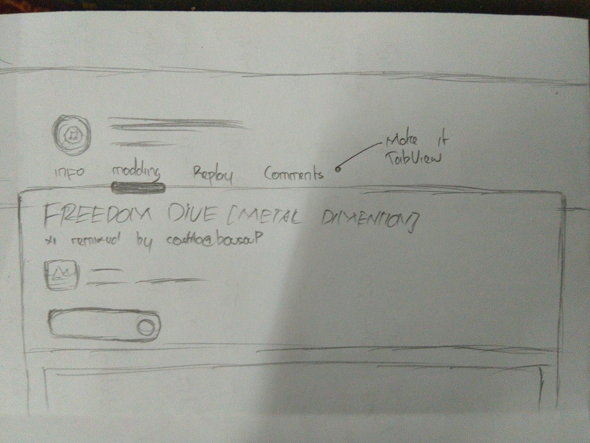
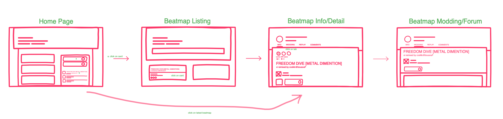

# Usability Evaluation and Prototyping (again)
## Operating the Prototype
> Youtube Link: https://youtu.be/fNoG_gXKj4s

---

## Part A: Usability Evaluation
### 1. Brief Description of Participants
#### a. Description of Participant 1 (Same tester with last CI)
 - Male, ~21 years old
- Universitas Airlangga student
- Formerly an osu! player
- Familiar with old osu! Webpage, but not with the current webpage
- The reason why I chose him because he don't really like the new website design over the old design cause he need times to make him used to the design, so I think he's a good candidate for this testing

#### b. Description of Participant 2
- Female, ~18 years old
- Student at national High School in Malang
- Knew about osu! but not a regular player
- Almost never open the osu! webpage
- The reason why I chose her because she's novice to the system but still know some terminology related to osu!

### 2. Evaluation Script
- Login and open homepage
- Pick the beatmap
- Go to the beatmap page
- Go to beatmap discussion page (modding)
- Look for some replays or comments
- Go back to beatmap page without explicitly go back using browser back button
- Go back to homepage or beatmap page

Question for the application test:

- Suppose that you want to open a beatmap then check the beatmap discussion then after that check the beatmap comment to see what people talks about the beatmap. How to accomplish that?

### 3. Transcript

#### a. Transcript with Participant 1

1. You: halo
2. Participant: halo lagi
3. You: Iya jadi kita bakal ngelakuin test lagi, mirip mirip lah sama yang kemaren
4. Participant: hoo…oke oke, literally sama?
5. You: Bisa dibilang sama, tapi tidak terlalu sama juga. Jadi aku bakal ngasih sebuah task yang harus diselesaikan, mirip dengan yang kemarin, nah dalam prosesnya silahkan ceritakan apa saja yang kamu lihat dan kamu mungkin rasa itu sesuai atau tidak sesuai disitu. Paham nggak?
6. Participant: Oke anggap aku paham, gas
7. You: Lah haha, oke oke. Perlu kuingatkan lagi jadi disini yang ditest adalah aplikasinya bukan kamu. Jadi gausah sok keren lah intinya
8. Participant: Anjir hahaha, oke oke, berarti aku harus ngapain ini
9. You: Oke, jadi hampir sama seperti yang lalu, kamu diminta buka beatmap discussion dari sebuah beatmap, lalu setelah itu cek beatmap commentnya, lalu bisa balik ke beatmap info lagi atau beatmap listing lagi. Jelas nggak?
10. Participant: ho oke oke, sek persiapan
11. You: oke oke bisa dimulai
12. Participant: Oke mulai dari login ternyata, eh ini login atau register? Oh login deng yang bisa. Oke di klik langsung keluar popup, boleh la daripada di redirect ke page lain bikin susah. Lah kok akunmu nen?
13. You: gausah protes njir
14. Participant: Yha, oke oke. Oke masuk ke homepage sekarang, misal aku langsung klik beatmap sing ndek kene iso nggak?
15. You: Bebas, lewat mana ae
16. Participant: Woke, harus e bisa se. Oh mantap langsung masuk beatmap info. Loh kok beda? Nggak kayak sing asli sama yang kemaren?
17. You: Yha tujuan e kita iku njir hhahaha
18. Participant: Hooo akhir e aku paham alasanmu ngajak aku. Kenopo ndek unair gak ada iki yo
19. You: mana saya tau, lanjut lanjut eh
20. Participant: Hoo iki keren sih, ada tab-tab e. Langsung pindah page e jelas berarti, menarik menarik. Berarti aku tadi ke beatmap discussion yo, oke berarti iki. Sakjane modding iki ganti discussion ae, wong awam gak paham banget lek modding iki isi e tempat mapper e berdiskusi
21. You: oke oke noted
22. Participant: oke sekarang ke discussion. Oh sek mirip mbek asli e ternyata, oke langsung ke beatmap comment. ah kok putih sih njir, nggak item juga opo warna gelap lain e. cek mirip sama background e, sek replay yo sisan njir. Nggarai sakit mata ae hahaha
23. You: hahaha iyo sih
24. Participant: Oke gak masalah sih lain e, wes jelas arah e kemana nggak kayak kemaren. Oke balik ke beatmap info, terus balik home opo beatmap listing iki?
25. You: terserah 
26. Participant: Oke home ae, done 
27. You: Oke suwun suwun, mantap terimakasih sudah membantu hehe
28. ….

#### b. Transcript with Participant 2

1. You: Halo
2. Participant: Halo
3. You: Jadi disini kita bakal ngelakuin test terhadap sebuah mockup dari web osu, jadi kalau boleh tau sering buka atau main osu sebelumnya?
4. Participant: Cuma tau sama pernah main aja sih, cuma nggak yang selalu gitu
5. You: Oke oke, berarti jarang buka webnya juga ya
6. Participant: Iya
7. You: Oke, jadi disini kita bakal ngetes web osu yang sudah diubah, jadi mungkin perubahannya nggak kamu tau sih
8. Participant: ho oke, ini ngapain berarti?
9. You: Jadi tugasnya disini kamu dikasih sebuah task yang harus diselesaikan, kamu bakal disuruh login lalu buka salah satu beatmap lalu buka discussion dan replynya terakhir balik lagi, nah dalam prosesnya silahkan ceritakan apa saja yang kamu lihat dan kamu mungkin rasa itu sesuai atau tidak sesuai disitu. Paham nggak?
10. Participant: Nggak terlalu sih, tapi bisa lah kayaknya
11. You: Oke mulai ya
12. Participant: Oke, ini halaman pertama, ini ada tulisan login, oh udah langsung diisiin ya, oke langsung masuk
13. Perticipant: Ini masuk homepage-nya kayaknya, ada tombol beatmaps diatas sama ada beat maps di kanan. Kayaknya mencet yang diatas
14. Participant: Oke sekarang di homepage-nya beatmap kayaknya, banyak sekali beatmapnya, ini yang dipilih yang mana?
15. You: Yang bisa dipencet cuma sebiji sih hehe, yang pertama
16. Participant: Oke-oke, ini sekarang masuk ke beatmap info namanya, gaada yang aneh, semua ada disini yang berhubungan sama beatmapnya, terus sekarang ke diskusi, ini ada tombol diskusi.
17. Participant: Oke sekarang setelah ke diskusi, ke replay sama comment, satu satu dari replay. Lho ini emang putih? 
18. You: Iyes
19. Participant: hoo, aneh sih sebenernya dari gelap-gelap tiba tiba putih, lainnya udah normal aja sih, lalu ke comment. Oh ini putih juga ya, sama sih berarti sama yang satunya tadi
20. Participant: Oke ini terus balik kan ya abis ini
21. You: Iya, balik ke home atau beatmap info
22. Participant: Oke balik ke beatmap info, sip ke home
23. You: Sip mantap

### 4. Feedback and Incidence Analysis
#### OBSERVATION 1 - Homepage when not login

 - **Reference**: Participant **1** line **12**
 - **Feedback**: It's good when it provide popup instead of redirect user to another page
 - **Incidence**: -
 - **Reason**: -
 - **Resolution**: -

#### OBSERVATION 2 - Homepage when already login

- **Reference**: Provide line-number(s) or time-code(s) referred by feedback/incidence observed on the screen.
- **Feedback**: Provide feedback (positive or negative) given by the participants, if any.
- **Incidence**: Critical incidences (breakdowns or problems encountered by the participants) and/or mistakes committed by the participants, if any.
- **Reason**: Explain the reason for the breakdowns or the negative feedback observed on the screen.
- **Resolution**: Suggest any modifications that might be made to the UI to address the issues in this `OBSERVATION 1`.

#### OBSERVATION 3 - Beatmap Listing page

- **Reference**: -
- **Feedback**: -
- **Incidence**: -
- **Reason**: -
- **Resolution**: -

#### OBSERVATION 4 - Beatmap Info page

- **Reference**: Participant **1** line **20**, participant **2** line **16**
- **Feedback**: It's easier to move one to other page with tab
- **Incidence**: Not really an incidence, but user said that modding text should be discussion to make user not misunderstanding, user click *Diskusi* button, not the modding tab
- **Reason**: Cause it can lead novice user who don't know much about osu terminology to wrong direction, looks like the *diskusi* button too obvious and have redundant behavior with tab
- **Resolution**: Change the Modding title to Discussion, remove the button

#### OBSERVATION 5 - Beatmap Modding page

- **Reference**: -
- **Feedback**: -
- **Incidence**: -
- **Reason**: -
- **Resolution**: -

#### OBSERVATION 6 - Beatmap Replay page

- **Reference**: Participant **1** line **22**, participant **2** line 19
- **Feedback**: The white background is not should be there
- **Incidence**: It make no sense from dark themed web then suddenly user encounter white screen.
- **Reason**: Inconsistency color picking for background
- **Resolution**: Change it to dark themed color background.

#### OBSERVATION 7 - Beatmap Comments page

- **Reference**: Participant **1** line **22**, participant **2** line 19
- **Feedback**: The white background is not should be there
- **Incidence**: It make no sense from dark themed web then suddenly user encounter white screen.
- **Reason**: Inconsistency color picking for background
- **Resolution**: Change it to dark themed color background.

---

## Part B: Prototyping (again)
### Sketch

(Actually this is the same design with previous task, but the only thing I edit is the color)

### Design Rationale

What the most noticeable from user says on CI is my background color pick on *Replay* and *Comment* section. Here user really surprised when I use white background instead of dark background when user experienced dark theme from the beginning. That's why on my latest design, I rid all of white theme left to dark theme by changing the background to something darker. 

### High-Fidelity Interactive-Prototype
Link: https://xd.adobe.com/view/80347b3d-e268-4604-68dc-f3790c2a01f7-f605/?fullscreen